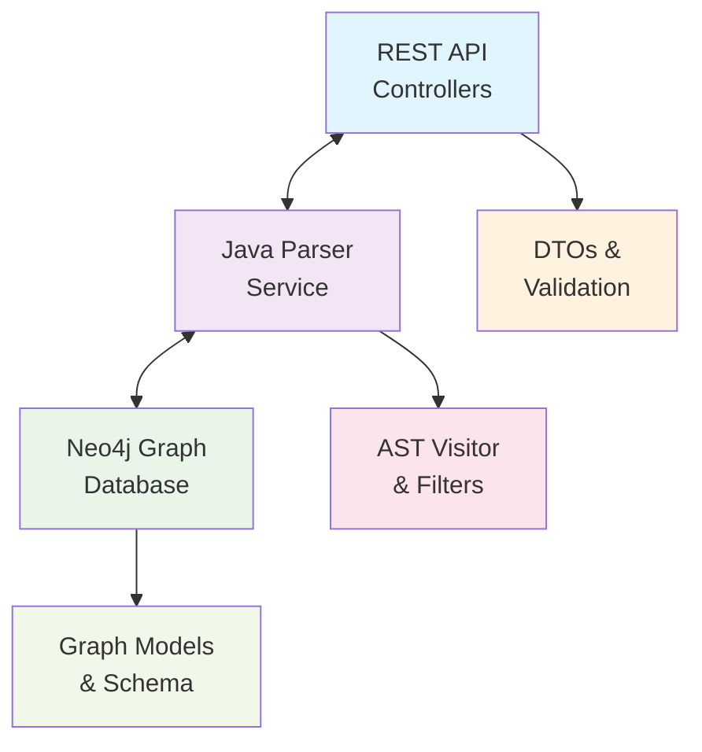
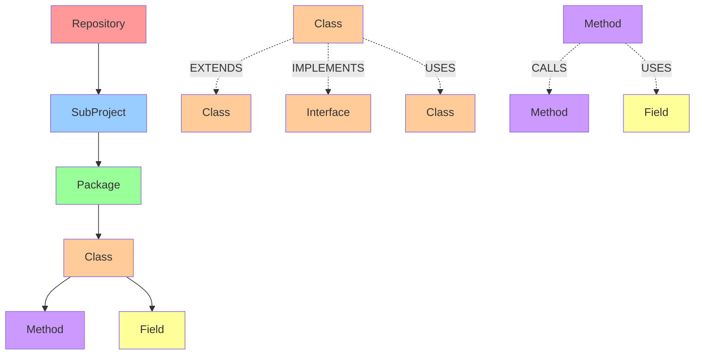
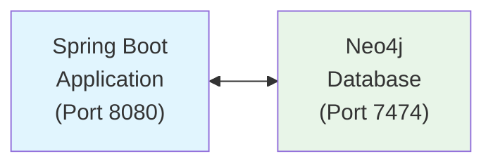
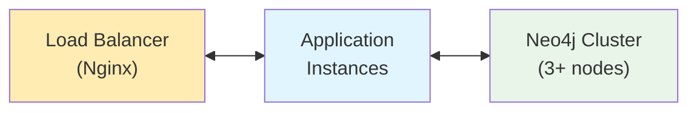

# Architecture Documentation

## System Overview

The Java Graph RAG system is designed as a layered architecture that transforms Java source code into a graph representation for intelligent code analysis and retrieval.

## Architecture Layers

### 1. Presentation Layer

- **REST Controllers**: Handle HTTP requests for code ingestion and health checks
- **API Documentation**: OpenAPI/Swagger documentation for endpoints
- **Error Handling**: Centralized error handling and response formatting

### 2. Business Logic Layer

- **Java Parser Service**: Core service for parsing Java source code
- **Graph Service**: Manages graph database operations
- **Query Engine**: Converts natural language to graph queries (Phase 2)
- **LLM Integration**: AI model integration for code analysis (Phase 2)

### 3. Data Access Layer

- **Graph Repository**: Neo4j data access operations
- **Graph Models**: Domain entities mapped to graph nodes
- **DTOs**: Data transfer objects for API communication

### 4. Infrastructure Layer

- **Configuration**: Application and database configuration
- **Docker**: Containerization for deployment
- **Health Monitoring**: Application health and metrics

## Component Architecture



## Data Flow

### Code Ingestion Flow

1. **HTTP Request**: Client sends Java project path via REST API
2. **Validation**: Request validation and filtering configuration
3. **File Discovery**: Recursive Java file discovery with filtering
4. **AST Parsing**: JavaParser creates Abstract Syntax Trees
5. **Element Extraction**: AST visitor extracts code elements
6. **Graph Storage**: Elements stored as nodes in Neo4j
7. **Response**: Success/failure response to client

### Query Flow (Phase 2)

1. **Natural Language Query**: User submits question in natural language
2. **Query Processing**: Convert to Cypher graph queries
3. **Graph Traversal**: Execute queries against Neo4j
4. **Context Retrieval**: Extract relevant code chunks
5. **LLM Augmentation**: Enhance prompts with code context
6. **Response Generation**: Generate AI-powered responses

## Technology Stack

### Backend Framework

- **Spring Boot 3.2.0**: Main application framework
- **Spring Web**: REST API support
- **Spring Data Neo4j**: Graph database integration
- **Spring Validation**: Request validation

### Java Parsing

- **JavaParser 3.25.5**: AST parsing library
- **Custom Visitors**: Code element extraction
- **File Filtering**: Configurable file inclusion/exclusion

### Graph Database

- **Neo4j 5.15**: Graph database
- **Cypher**: Graph query language
- **APOC**: Neo4j procedures and utilities

### Development Tools

- **Maven**: Build and dependency management
- **Docker**: Containerization
- **JUnit 5**: Unit testing
- **Mockito**: Mocking framework

## Graph Schema Design

### Node Types

```cypher
// Repository nodes
(:Repository {
  id: String,
  name: String,
  organization: String,
  url: String,
  path: String,
  commit_hash: String,
  commit_date: DateTime,
  language_stats: Map,
  created_at: DateTime,
  updated_at: DateTime
})

// SubProject nodes
(:SubProject {
  id: String,
  name: String,
  type: String,
  path: String,
  version: String,
  description: String,
  dependencies: List<String>,
  source_directories: List<String>,
  test_directories: List<String>,
  repository_id: String,
  created_at: DateTime,
  updated_at: DateTime
})

// Package nodes
(:Package {
  id: String,
  name: String,
  path: String,
  file_path: String,
  line_start: Integer,
  line_end: Integer,
  created_at: DateTime,
  updated_at: DateTime
})

// Class nodes
(:Class {
  id: String,
  name: String,
  visibility: String,
  modifiers: List<String>,
  is_interface: Boolean,
  is_enum: Boolean,
  is_annotation: Boolean,
  is_external: Boolean,
  file_path: String,
  line_start: Integer,
  line_end: Integer,
  package_name: String,
  repository_id: String,
  created_at: DateTime,
  updated_at: DateTime
})

// Method nodes
(:Method {
  id: String,
  name: String,
  visibility: String,
  modifiers: List<String>,
  return_type: String,
  parameters: List<String>,
  parameter_names: List<String>,
  file_path: String,
  line_start: Integer,
  line_end: Integer,
  class_name: String,
  package_name: String,
  created_at: DateTime,
  updated_at: DateTime
})

// Field nodes
(:Field {
  id: String,
  name: String,
  visibility: String,
  modifiers: List<String>,
  type: String,
  file_path: String,
  line_number: Integer,
  class_name: String,
  package_name: String,
  created_at: DateTime,
  updated_at: DateTime
})
```

### Relationship Types

```cypher
// Structural relationships
(:Repository)-[:CONTAINS]->(:SubProject)
(:SubProject)-[:CONTAINS]->(:Package)
(:Package)-[:CONTAINS]->(:Class)
(:Class)-[:CONTAINS]->(:Method)
(:Class)-[:CONTAINS]->(:Field)

// Inheritance relationships
(:Class)-[:EXTENDS]->(:Class)
(:Class)-[:IMPLEMENTS]->(:Class)

// Dependency relationships (Enhanced in STORY_013)
(:Method)-[:CALLS]->(:Method)
(:Class)-[:USES {
  type: "import|instantiation|parameter_type|return_type|field_type",
  context: String,
  fullyQualifiedName: String,
  isExternal: Boolean
}]->(:Class)
(:Method)-[:USES]->(:Field)
(:Class)-[:DEPENDS_ON]->(:Class)
```

### Graph Schema Visualization



## Security Considerations

### Authentication & Authorization

- **Neo4j Authentication**: Username/password authentication
- **API Security**: Input validation and sanitization
- **File System Access**: Restricted to specified source paths

### Data Protection

- **Source Code**: Only metadata stored, not full source
- **Access Control**: Database access controls
- **Audit Trail**: Creation and update timestamps

## Scalability Design

### Horizontal Scaling

- **Stateless Services**: REST API can be scaled horizontally
- **Database Clustering**: Neo4j clustering for high availability
- **Load Balancing**: API gateway for request distribution

### Performance Optimization

- **Batch Processing**: Bulk graph operations
- **Indexing**: Database indexes for query performance
- **Caching**: Application-level caching (Phase 2)

## Deployment Architecture

### Development Environment



### Production Environment



## Monitoring & Observability

### Health Checks

- **Application Health**: Spring Boot Actuator endpoints
- **Database Health**: Neo4j connection monitoring
- **Service Health**: Individual service health checks

### Metrics & Logging

- **Application Metrics**: Performance and usage metrics
- **Graph Metrics**: Database query performance
- **Structured Logging**: JSON-formatted application logs

## Future Architecture Considerations

### Microservices Evolution

- **Service Decomposition**: Split into focused microservices
- **Event-Driven Architecture**: Async communication between services
- **API Gateway**: Centralized API management

### AI/ML Integration

- **Vector Embeddings**: Code semantic embeddings
- **ML Models**: Code analysis and recommendation models
- **Real-time Processing**: Stream processing for code changes
