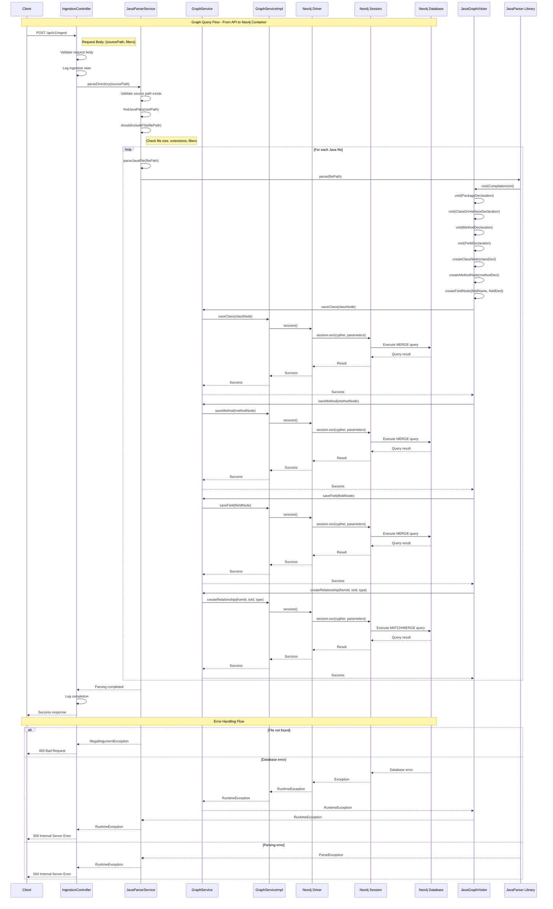

# Graph Query Sequence Flow

This document illustrates the complete sequence flow from a graph query API call through to the leaf method calls in the Neo4j container.

## Sequence Diagram



## Key Components in the Flow

### 1. **API Layer**

- **IngestionController**: Handles HTTP requests and responses
- **Request Validation**: Validates input parameters
- **Error Handling**: Returns appropriate HTTP status codes

### 2. **Parser Service**

- **JavaParserService**: Orchestrates the parsing process
- **File Discovery**: Recursively finds Java files
- **File Filtering**: Applies size and extension filters
- **AST Processing**: Uses JavaParser to create Abstract Syntax Trees

### 3. **AST Visitor**

- **JavaGraphVisitor**: Custom visitor for extracting code elements
- **Node Creation**: Creates ClassNode, MethodNode, FieldNode objects
- **Metadata Extraction**: Extracts line numbers, visibility, modifiers

### 4. **Graph Service**

- **GraphService Interface**: Abstract service for graph operations
- **GraphServiceImpl**: Neo4j implementation
- **CRUD Operations**: Save operations for all node types
- **Relationship Management**: Creates relationships between nodes

### 5. **Neo4j Integration**

- **Neo4j Driver**: Database connection management
- **Session Management**: Handles database sessions
- **Cypher Queries**: Executes parameterized Cypher queries
- **Transaction Handling**: Manages database transactions

## Database Operations

### Node Creation Queries

```cypher
// Class Node
MERGE (c:Class {id: $id})
SET c.name = $name,
    c.visibility = $visibility,
    c.modifiers = $modifiers,
    c.file_path = $filePath,
    c.line_start = $lineStart,
    c.line_end = $lineEnd

// Method Node
MERGE (m:Method {id: $id})
SET m.name = $name,
    m.visibility = $visibility,
    m.return_type = $returnType,
    m.parameters = $parameters,
    m.file_path = $filePath,
    m.line_start = $lineStart,
    m.line_end = $lineEnd

// Field Node
MERGE (f:Field {id: $id})
SET f.name = $name,
    f.visibility = $visibility,
    f.type = $type,
    f.file_path = $filePath,
    f.line_number = $lineNumber
```

### Relationship Creation

```cypher
// Relationship between nodes
MATCH (from), (to)
WHERE from.id = $fromId AND to.id = $toId
MERGE (from)-[r:RELATIONSHIP_TYPE]->(to)
```

## Error Handling

### 1. **File System Errors**

- Invalid source path
- File size exceeds limits
- Permission denied

### 2. **Parsing Errors**

- Invalid Java syntax
- Unsupported language features
- Memory issues with large files

### 3. **Database Errors**

- Connection failures
- Query execution errors
- Transaction rollbacks

### 4. **Application Errors**

- Null pointer exceptions
- Validation failures
- Configuration errors

## Performance Considerations

### 1. **Batch Processing**

- Process multiple files efficiently
- Use connection pooling
- Implement batch inserts

### 2. **Memory Management**

- Stream large files
- Clean up AST objects
- Monitor heap usage

### 3. **Database Optimization**

- Use parameterized queries
- Implement proper indexing
- Monitor query performance

## Monitoring and Logging

### 1. **Application Logs**

- Request/response logging
- Parsing progress tracking
- Error details and stack traces

### 2. **Database Monitoring**

- Query execution times
- Connection pool usage
- Transaction statistics

### 3. **Performance Metrics**

- Files processed per second
- Database operations per second
- Memory usage patterns

This sequence diagram provides a comprehensive view of how the Java Graph RAG system processes code ingestion requests from the API layer through to the Neo4j database container, showing all the key interactions and error handling paths.
