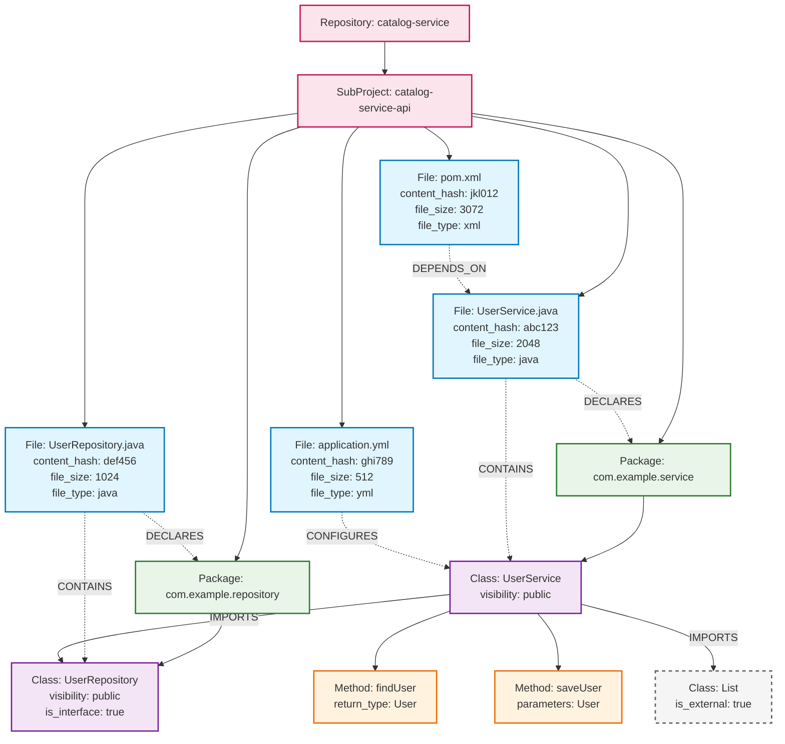

# STORY_018_FILE_NODE_MODELING

## Story Information

- **Story Number**: STORY_018
- **Story Name**: File Node Modeling for Enhanced Schema Architecture
- **Epic**: Schema Architecture Enhancement
- **Priority**: HIGH
- **Estimated Duration**: 1.5 weeks
- **Dependencies**: STORY_007_UPSERT_PATTERN_IMPORT (COMPLETED)
- **Status**: NOT_STARTED

## Overview

Introduce File nodes as first-class entities in our graph schema to represent **all types of files** in a codebase - Java source files, XML configurations, properties files, build files, and more. Files serve as containers for their content elements, enabling file-level metadata tracking, better modeling of multi-file projects, and foundation for content hash optimization. This architectural enhancement provides more accurate representation of project structure and enables advanced file-based operations across all file types.

## User Story

**As a** developer analyzing codebases  
**I want** file-level information and relationships for all file types in the graph  
**So that** I can perform file-based queries, track file changes across Java/XML/properties/build files, understand configuration dependencies, and get more accurate project structure representation

## Background

Currently, our schema stores file paths as properties on Class, Method, and Field nodes. This approach has limitations:

1. **Duplicated Data**: Multiple classes in the same file repeat the same file_path
2. **Missing File Context**: No representation of file-level constructs like import statements
3. **Limited Queries**: Cannot easily query "all classes in this file" or "files importing X"
4. **No File Metadata**: Cannot store file size, encoding, modification time, or content hashes
5. **Import Modeling Gap**: Import statements are file-level but we model them as class relationships

File nodes provide a natural container for:

- **Content Hashes**: Enable efficient change detection (foundation for STORY_017)
- **Import Statements**: File-level imports that affect all contained classes
- **Multi-Class Files**: Proper modeling of files with multiple classes
- **File Metadata**: Size, encoding, timestamps for analysis
- **Version Control Integration**: Files are the unit of change in Git

This story provides essential infrastructure for performance optimization, better queries, and more accurate code modeling.

## Acceptance Criteria

- [ ] File nodes exist as first-class entities with comprehensive metadata
- [ ] Files properly contain Classes with bidirectional CONTAINS/CONTAINED_IN relationships
- [ ] Import relationships remain at Class level (semantic relationships unchanged)
- [ ] File content hash property ready for optimization (STORY_017)
- [ ] All existing functionality preserved with enhanced capabilities
- [ ] Migration path for existing data without file information

## Technical Requirements

### Functional Requirements

- [ ] Create FileNode model with comprehensive properties (path, hash, size, timestamps)
- [ ] Establish CONTAINS relationships from File to Class nodes
- [ ] Model IMPORTS relationships at file level
- [ ] Update JavaGraphVisitor to create File nodes first
- [ ] Modify existing queries to work through File relationships
- [ ] Support both file-based and direct class access patterns

### Non-Functional Requirements

- [ ] **Performance**: File node operations add <10% overhead to parsing
- [ ] **Compatibility**: Existing API endpoints continue to work unchanged
- [ ] **Migration**: Seamless upgrade path for databases without File nodes
- [ ] **Storage**: Minimal storage overhead for File metadata

## Technical Implementation

### Architecture Changes

The schema hierarchy becomes:

```
Repository -> SubProject -> Package -> File -> Class -> Method/Field
```

Key relationship changes:

- **Before**: Package -[:CONTAINS]-> Class
- **After**: Package -[:CONTAINS]-> File -[:CONTAINS]-> Class

Import modeling changes:

- **Before**: Class -[:USES {type: "import"}]-> Class
- **After**: File -[:IMPORTS]-> Class, Class -[:USES {type: "import"}]-> Class (derived)

### Example Project Structure

Here's how a typical Spring Boot project would be modeled with File nodes:



**Legend:**

- **Solid arrows**: Logical relationships (package containment, imports, inheritance)
- **Dotted arrows**: Physical relationships (file containment, metadata)
- **File nodes** (blue): Provide content hashes, file metadata, version control info
- **Class nodes** (purple): Maintain semantic relationships (imports, extends, implements)
- **Package nodes** (green): Logical code organization
- **Method nodes** (orange): Class members
- **External nodes** (gray dashed): External dependencies (JDK, libraries)

### New Components

- **FileNode**: Graph node model for Java source files
- **FileFactory**: Create and manage File node instances with metadata
- **FileMetadataExtractor**: Extract file system metadata (size, encoding, timestamps)
- **FileContentHasher**: Calculate content hashes for files (foundation for STORY_017)

### Modified Components

- **JavaGraphVisitor**: Create File nodes with metadata, preserve Class-level semantic relationships
- **RelationshipManager**: Handle File-Class physical containment, maintain logical Class-Package relationships
- **DependencyAnalyzer**: Continue processing imports at Class level (no changes to semantic analysis)
- **NodeFactory**: Update to work with File-Class hierarchy
- **UpsertServiceImpl**: Support File node upsert operations

### Database Schema Changes

```cypher
// Add File node definition
(:File {
  id: String,                    // Unique identifier
  path: String,                  // Relative path from repository root
  absolute_path: String,         // Full system path
  file_type: String,            // java, xml, properties, yml, json, md, gradle, maven, etc.
  content_hash: String,          // SHA-256 of file content (ready for STORY_017)
  file_size: Integer,           // File size in bytes
  encoding: String,             // File encoding (e.g., UTF-8)
  line_count: Integer,          // Total lines in file

  // Java-specific properties (when file_type = "java")
  class_count: Integer,         // Number of classes in file (Java only)
  package_name: String,         // Package declared in file (Java only)

  // Generic metadata for all file types
  mime_type: String,            // MIME type for file classification
  is_binary: Boolean,           // Whether file contains binary data
  repository_id: String,        // Parent repository
  created_at: DateTime,
  updated_at: DateTime,
  last_modified: DateTime       // File system modification time
})

// Add File indexes
CREATE INDEX IF NOT EXISTS FOR (f:File) ON (f.id);
CREATE INDEX IF NOT EXISTS FOR (f:File) ON (f.path);
CREATE INDEX IF NOT EXISTS FOR (f:File) ON (f.file_type);
CREATE INDEX IF NOT EXISTS FOR (f:File) ON (f.content_hash);
CREATE INDEX IF NOT EXISTS FOR (f:File) ON (f.repository_id);
CREATE INDEX IF NOT EXISTS FOR (f:File) ON (f.package_name);
CREATE INDEX IF NOT EXISTS FOR (f:File) ON (f.mime_type);

// Add File constraints
CREATE CONSTRAINT IF NOT EXISTS FOR (f:File) REQUIRE f.id IS UNIQUE;

// Update relationships - Physical containment
(:SubProject)-[:CONTAINS]->(:File)        // Files belong to sub-projects
(:File)-[:CONTAINS]->(:Class)             // Files physically contain classes
(:Class)-[:CONTAINED_IN]->(:File)         // Reverse relationship for easy queries

// Logical hierarchy (unchanged - semantic relationships remain at Class/Package level)
(:Package)-[:CONTAINS]->(:Class)          // Logical package containment
(:Class)-[:IMPORTS]->(:Class)             // Import relationships stay at class level
(:Class)-[:EXTENDS]->(:Class)             // Inheritance at class level
(:Class)-[:IMPLEMENTS]->(:Class)          // Interface implementation at class level

// File-level metadata relationships
(:File)-[:DECLARES]->(:Package)           // File declares a package
(:Package)-[:DECLARED_IN]->(:File)        // Reverse relationship

// Generic file relationships (extensible for future parsers)
(:File)-[:REFERENCES]->(:File)            // Generic file-to-file references
(:File)-[:CONFIGURES]->(:Class)           // XML/Properties configuring Java classes
(:File)-[:DEPENDS_ON]->(:File)            // Build file dependencies
```

### API Changes

No breaking changes to external APIs. All existing endpoints continue to work.

Internal query patterns enhanced:

```cypher
// Logical relationships unchanged (semantic queries work as before)
MATCH (p:Package)-[:CONTAINS]->(c:Class)
WHERE p.name = 'com.example'
RETURN c

// Enhanced with file information when needed
MATCH (p:Package)-[:CONTAINS]->(c:Class)<-[:CONTAINS]-(f:File)
WHERE p.name = 'com.example'
RETURN c, f.path, f.content_hash

// File-centric queries now possible
MATCH (f:File)-[:CONTAINS]->(c:Class)
WHERE f.path = 'MyService.java'
RETURN c
```

## Validation Cases

### Test Scenarios

- [ ] **Java files**: Single and multi-class files, imports, package declarations
- [ ] **XML files**: Spring configuration files, Maven POM files
- [ ] **Properties files**: application.properties, configuration files
- [ ] **YAML files**: application.yml, Docker compose files
- [ ] **Build files**: pom.xml, build.gradle, package.json
- [ ] **Documentation files**: README.md, \*.txt files
- [ ] **Content hash**: File content hash calculated for all file types
- [ ] **File type detection**: Accurate MIME type and file_type classification
- [ ] **Migration scenario**: Existing data upgraded without File nodes

### Edge Cases

- [ ] **Empty files**: Handle empty files of any type gracefully
- [ ] **Large files**: Efficiently process large files (Java with many classes, large XMLs)
- [ ] **Binary files**: Detect and handle binary files (JARs, images) appropriately
- [ ] **Symbolic links**: Handle file system links correctly
- [ ] **File permissions**: Handle unreadable files gracefully
- [ ] **Concurrent access**: Thread-safe file processing

## Success Criteria

### Functional Success

- [ ] All project files (Java, XML, Properties, YAML, etc.) represented as File nodes with complete metadata
- [ ] Perfect containment hierarchy: File -> Class -> Method/Field
- [ ] File-level import statements properly modeled
- [ ] Content hash foundation ready for STORY_017 optimization

### Performance Success

- [ ] **<10% parsing overhead** for File node creation
- [ ] **Same query performance** for existing class-based queries
- [ ] **Enhanced query capabilities** for file-based analysis
- [ ] **Efficient file metadata** storage and retrieval

### Quality Success

- [ ] 100% test coverage for File node operations
- [ ] Comprehensive integration tests with real multi-class files
- [ ] Migration testing with existing graph data
- [ ] Backward compatibility verified for all APIs

## Dependencies

### External Dependencies

- **Java NIO**: For file metadata and content hash calculation
- **JavaParser**: Enhanced to track file-level information
- **Neo4j**: Schema migration support for new File nodes

### Internal Dependencies

- **STORY_007**: ✅ COMPLETED - Provides upsert infrastructure for File nodes
- **Current parsing system**: Foundation to enhance with File modeling

## Deliverables

### Code Changes

- [ ] FileNode model class with comprehensive properties
- [ ] FileFactory for File node creation and management
- [ ] Enhanced JavaGraphVisitor with File-first processing
- [ ] ImportManager for file-level import handling
- [ ] FileContentHasher for content hash calculation
- [ ] Updated RelationshipManager for File-Class relationships
- [ ] Schema migration support for File nodes

### Documentation

- [ ] Updated architecture documentation with File node hierarchy
- [ ] File node query patterns and examples
- [ ] Migration guide for existing deployments
- [ ] Content hash strategy documentation (STORY_017 foundation)

### Testing

- [ ] Unit tests for FileNode model and operations
- [ ] Integration tests with multi-class files and imports
- [ ] Migration testing with existing graph data
- [ ] Performance benchmarks for File node overhead

## Risk Assessment

### Technical Risks

- **Risk**: Schema migration complexity for existing data
- **Impact**: MEDIUM
- **Mitigation**: Comprehensive migration scripts and backward compatibility

- **Risk**: Performance impact of additional File nodes
- **Impact**: LOW
- **Mitigation**: Efficient indexing and lazy loading strategies

- **Risk**: Complexity in handling file system edge cases
- **Impact**: MEDIUM
- **Mitigation**: Robust error handling and fallback mechanisms

### Business Risks

- **Risk**: Breaking changes to existing functionality
- **Impact**: HIGH
- **Mitigation**: Maintain full backward compatibility and comprehensive testing

- **Risk**: Development time vs. immediate value
- **Impact**: LOW
- **Mitigation**: Story provides foundation for multiple future optimizations

## Example Usage

### API Examples

```bash
# Existing endpoints continue to work unchanged
curl -X POST http://localhost:8080/api/v1/ingest \
  -d '{"sourcePath": "/path/to/project"}'

# Enhanced queries now possible through File relationships
```

### Query Examples

```cypher
// Find all classes in a specific Java file
MATCH (f:File {path: "src/main/java/com/example/MyService.java", file_type: "java"})-[:CONTAINS]->(c:Class)
RETURN c.name

// Find Java files containing classes that import ArrayList (semantic relationship preserved)
MATCH (f:File {file_type: "java"})-[:CONTAINS]->(c:Class)-[:IMPORTS]->(imported:Class {name: "ArrayList"})
RETURN f.path, c.name

// Find all XML configuration files
MATCH (f:File {file_type: "xml"})
WHERE f.path CONTAINS "spring" OR f.path CONTAINS "config"
RETURN f.path, f.file_size

// File type distribution analysis
MATCH (f:File)
WITH f.file_type as type, count(f) as file_count, sum(f.file_size) as total_size
RETURN type, file_count, total_size
ORDER BY file_count DESC

// Find large configuration files that might need attention
MATCH (f:File)
WHERE f.file_type IN ["xml", "properties", "yml"] AND f.file_size > 10000
RETURN f.path, f.file_type, f.file_size
ORDER BY f.file_size DESC

// Content hash ready for STORY_017 optimization (all file types)
MATCH (f:File)
WHERE f.content_hash IS NOT NULL
RETURN f.path, f.file_type, f.content_hash

// Cross-file-type relationships (future extensibility)
MATCH (xml:File {file_type: "xml"})-[:CONFIGURES]->(java:Class)
RETURN xml.path as config_file, java.name as configured_class

// Import analysis at class level (unchanged semantic relationships)
MATCH (c:Class)-[:IMPORTS]->(imported:Class)
WITH c, count(imported) as import_count
MATCH (c)<-[:CONTAINS]-(f:File)
RETURN f.path, c.name, import_count
ORDER BY import_count DESC
```

### Expected Output

```json
{
  "file": {
    "id": "file_MyService_java_abc123",
    "path": "src/main/java/com/example/MyService.java",
    "content_hash": "d4e5f6a7b8c9...",
    "class_count": 2,
    "file_size": 1024,
    "line_count": 45,
    "package_name": "com.example"
  },
  "classes": [
    { "name": "MyService", "line_start": 8, "line_end": 30 },
    { "name": "MyServiceHelper", "line_start": 32, "line_end": 42 }
  ],
  "imports": [
    { "class": "ArrayList", "fullyQualifiedName": "java.util.ArrayList" },
    { "class": "Logger", "fullyQualifiedName": "org.slf4j.Logger" }
  ]
}
```

## Implementation Phases

### Phase 1: File Node Infrastructure (Week 1)

- [ ] **Day 1-2**: FileNode model and schema

  - [ ] Create FileNode class with all properties
  - [ ] Database schema updates and indexes
  - [ ] FileFactory implementation
  - [ ] Basic file metadata extraction

- [ ] **Day 3-4**: File-Class relationships

  - [ ] Update RelationshipManager for File-Class containment
  - [ ] Modify JavaGraphVisitor to create Files first
  - [ ] Implement Package-File declaration relationships
  - [ ] Basic file content hash calculation

- [ ] **Day 5**: Testing and validation
  - [ ] Unit tests for FileNode operations with multiple file types
  - [ ] Integration tests with Java, XML, Properties, YAML files
  - [ ] File type detection accuracy validation
  - [ ] Validate schema migration approach

### Phase 2: Integration and Testing (Week 2)

- [ ] **Day 1-2**: File-Class integration testing

  - [ ] Validate File-Class containment relationships
  - [ ] Ensure semantic relationships (imports) remain at Class level
  - [ ] Test file metadata extraction and storage
  - [ ] Verify backward compatibility with existing Class-based queries

- [ ] **Day 3**: Migration and compatibility

  - [ ] Database migration scripts for existing data
  - [ ] Backward compatibility for nodes without File parents
  - [ ] API endpoint testing and validation

- [ ] **Day 4**: Performance optimization and documentation
  - [ ] Performance benchmarks and optimization
  - [ ] Update documentation and query examples
  - [ ] Prepare foundation for STORY_017 integration

## Future Considerations

### Phase 2.5 Integration

File nodes provide excellent foundation for LLM MCP integration:

- **File-level context**: LLM can understand entire file contents and imports
- **Change detection**: Content hashes enable targeted LLM analysis of modified files
- **Import analysis**: File-level imports provide better context for dependency understanding

### Phase 3 Integration

Advanced features benefit from File node foundation:

- **Temporal analysis**: Track file evolution through content hashes
- **Architectural insights**: File-level dependency analysis and patterns
- **Code quality metrics**: File-level complexity and maintainability analysis

## Acceptance Criteria Checklist

### Must Have

- [ ] **Complete File modeling**: All project files (Java, XML, Properties, YAML, etc.) represented as File nodes with metadata
- [ ] **Physical containment**: File CONTAINS Class relationships correctly established
- [ ] **Semantic relationships preserved**: Class-level imports, extends, implements unchanged
- [ ] **Content hash ready**: Foundation prepared for STORY_017 optimization
- [ ] **Backward compatibility**: Existing APIs and queries continue to work

### Should Have

- [ ] **Performance maintained**: <10% parsing overhead for File operations
- [ ] **Migration path**: Smooth upgrade for existing graph data
- [ ] **Comprehensive testing**: 100% coverage for new File functionality
- [ ] **Enhanced queries**: File-based analysis capabilities demonstrated

### Could Have

- [ ] **Multi-file-type analytics**: Size, complexity metrics across Java, XML, Properties files
- [ ] **Cross-file-type relationships**: XML configs referencing Java classes, Properties affecting behavior
- [ ] **Configuration analysis**: Spring XML parsing, Maven POM dependency extraction
- [ ] **File ecosystem insights**: Files that work together (Java + XML + Properties)
- [ ] **Content hash utilities**: Utilities ready for STORY_017 integration across all file types

### Won't Have

- [ ] **Complex file parsing**: Focus on file metadata and relationships, not deep content parsing of XML/YAML (saved for future stories)
- [ ] **File system monitoring**: Real-time file change detection (future story)
- [ ] **Cross-repository file analysis**: Single repository scope for this story
- [ ] **File content caching**: Full file content storage in graph database

## Notes

This story provides critical foundation for multiple future enhancements:

1. **STORY_017 (Git Hash Optimization)**: File nodes with content hashes enable 90%+ performance improvement for unchanged files
2. **Enhanced Queries**: File-level analysis capabilities unlock new insights
3. **Better Modeling**: More accurate representation of Java source code structure
4. **Future Stories**: Foundation for file-based analysis and optimization features

The implementation prioritizes backward compatibility - all existing functionality continues to work while gaining enhanced capabilities through File relationships.

Key insight: Files are natural containers for source code metadata and the proper level for import statement modeling. This architectural improvement aligns our graph structure with actual source code organization.

## Related Stories

- **STORY_007_UPSERT_PATTERN_IMPORT**: ✅ Foundation - provides upsert infrastructure for File nodes
- **STORY_017_GIT_HASH_OPTIMIZATION**: 📋 Direct beneficiary - File content hashes enable major performance optimization
- **STORY_005_MULTI_PROJECT_REPOSITORY_SUPPORT**: 🔄 Enhanced - File nodes improve multi-project file organization
- **STORY_013_CLASS_DEPENDENCY_ANALYSIS**: ✅ Enhanced - File-level imports provide better dependency context
- **Future LLM Integration**: File nodes provide natural context boundaries for AI analysis
